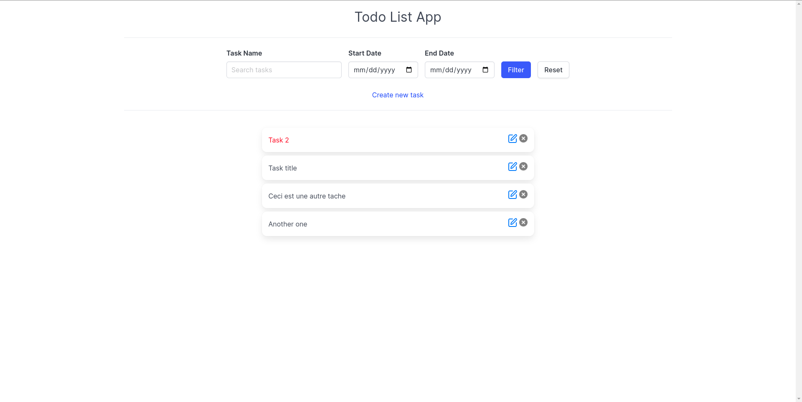

# TodoList app with vanilla js

## Setup

### Prerequisites

- Node environment (20+)

### Install dev dependencies

```
npm install
```

### Start

```
npm run dev
```

It opens on port [http://localhos:5173](http://localhost:5173)



## File structure

- `public`: static assets
- `src/components`: Custom elements that are reusable
- `src/pages`: Page for navigation
- `src/services`: Api calls to the backend
- `src/shared`: Utilities that are reusable in other project (signals, router, templates)

## Approach

The project is a SPA that uses custom elements and shadow dom for encapsulation.
It is divided into components and pages.
Components are reusable elements that can be used in any page.
Pages are the main navigation points.

Navigation is done with a simple router implementation. (`src/shared/router.js`)

Reactivity is done with a simple signal system. (`src/shared/signal.js`)

Pages are loaded dynamically with the router. Each page corresponds to a custom element.

## known issues

- No validation for the input fields
- No error handling for the api calls
- FOUC (Flash of unstyled content) on the first load for some pages, because of the external css loading on shadow dom.
